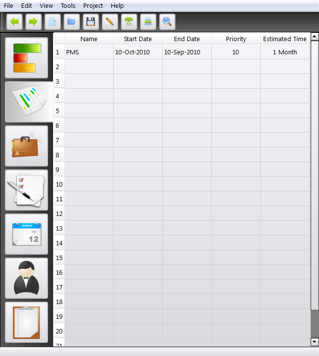
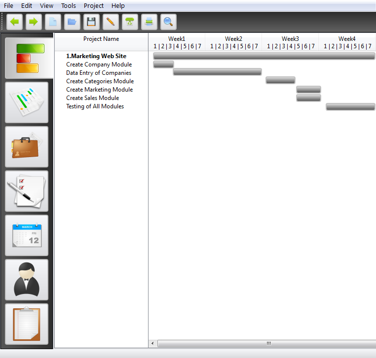
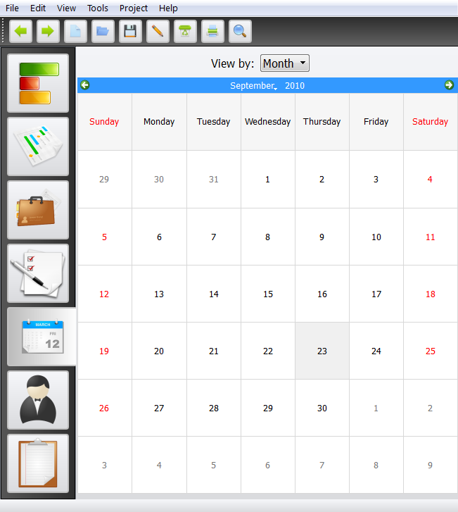
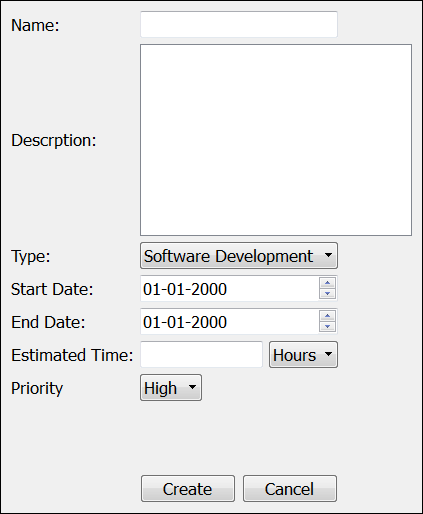
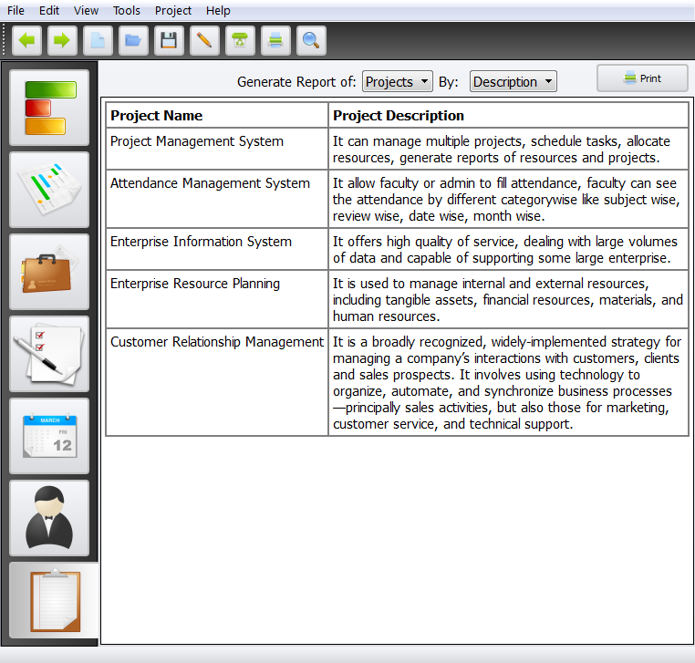

###### :rocket: my first ui design project 
## PMS Design: UI Design of Project Management System
### A design project for Project Management System which involved designing screens for different modules using Qt Designer.

* Tools: Qt Designer
* Modules: Tasks, Gantt Chart, Calendar, Resources, Reports, Users, Groups
* Month-Year: SEP-2010

### Screenshots

